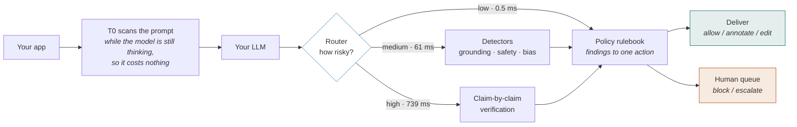

<div align="center">

# ControlPlane.ai

### The checkpoint between your AI and your users.

Every LLM response is inspected **before anyone reads it** — then allowed, annotated, edited, blocked, or sent to a human.

[](https://www.python.org/)
[](https://fastapi.tiangolo.com/)
[](https://react.dev/)
[](https://github.com/vllm-project/vllm)
[](https://www.mongodb.com/)


-2e86c9)


**Team NavRatnas** · Accenture Innovation Challenge 2026 · Problem Track 1

</div>

---

## The 30-second version

Your AI assistant tells a customer the warranty is **5 years**. Your actual policy says **3**.
It read a stale wiki page. Nothing errored. Nobody noticed for six weeks.

ControlPlane sits between your app and the model and catches it:

```diff
- The warranty on electronics is 5 years.
+ [withheld: contradicted by warranty.md, confidence 0.999]
```

We check three things on every response — is it **grounded**, is it **responsible**, did it **cost** more than it should — and take exactly one of five actions.

> **The hard part isn't checking. It's checking affordably.**
> Deep-checking every response adds ~500 ms and nobody ships that. So a cheap classifier
> predicts risk first, and we spend only the verification budget that response actually needs.

---

## Drop-in, one line

We speak the **OpenAI API**. Change one URL and everything keeps working — same request shape, same response shape, same streaming.

```diff
  client = OpenAI(
-     base_url="https://api.openai.com/v1",
+     base_url="http://your-controlplane:8080/v1",
  )
```

Your response comes back with an extra `cp` block that a plain client simply ignores:

```jsonc
{
  "choices": [{ "message": { "content": "..." } }],
  "cp": {
    "act": "edit",                    // what we did
    "tier": 1,                        // how hard we looked
    "pol_ver": "CS-BOT:IN:v4",        // which policy decided it
    "findings": [
      { "label": "pii", "sev": 3, "span": [22, 41], "evid": "card" }
    ],
    "edits": ["redact"]
  }
}
```

---

## How it works



### The tier ladder

Not everything deserves the same scrutiny. That is the whole idea.

| Tier | Runs on | Cost | What it does |
|:---:|---|---:|---|
| **T0** | 100% of traffic | **0.49 ms** | Regex PII with Luhn checksum, injection heuristics, denylist, cost math |
| **T1** | medium risk | **61 ms** | Neural grounding, safety, bias — three models, three processes, in parallel |
| **T2** | high risk | **739 ms** | Split into claims, retrieve evidence per claim, vote 3 times |
| **T3** | escalated | async | A bigger model reviews the decision, then a human sees it |

Blended, for a customer-support tenant: **~30 ms average instead of 500** — about **6%** of the compute.

---

## Three-valued grounding

**The one design decision that matters most.**

Most guardrails ask "is this true or false?" That is the wrong question, and it is why they get switched off.

| Verdict | Meaning | What we do |
|---|---|---|
| `SUPPORTED` | Our documents confirm it | Say nothing |
| `CONTRADICTED` | Our documents say the opposite | Edit or block |
| `UNVERIFIABLE` | **We found no evidence either way** | Annotate — **never block** |

> A claim we cannot verify might be perfectly true. If a customer asks something our
> documentation never covered, the model could be right and we'd have no idea.
> **Blocking true-but-unretrieved claims is the failure mode that kills guardrail products.**

This is enforced in code, per finding, before any action is computed — it holds even if someone misconfigures a policy to say otherwise.

---

## See it work

<details open>
<summary><b>Catching a stale-wiki hallucination</b></summary>

```
context   "All electronics carry a manufacturer warranty of 3 years."
model     "The warranty on electronics is 5 years."

risk 0.559 -> tier 1 -> NLI runs
finding    contradicted · sev 2 · conf 0.999 · evidence warranty.md · span [0,41]
action     edit -> removing it empties the answer -> escalate
```
Deleting the only sentence leaves nothing to send — and writing a replacement is not something an editor may do. So it escalates.
</details>

<details>
<summary><b>Stopping a card number mid-stream</b></summary>

```
model generates   "Certainly. Your card 4111 1111 1111 1111 is on file."
                   |-- released --||------ held, checked, blocked ------|
client receives   "Certainly."   finish_reason: content_filter
audit record      full text kept, pii finding sev 3 at chars [22,41]
```
We hold back the last **40 tokens**. Complete sentences are checked and released; a bad one never leaves the buffer. Cost: **1 ms**.
</details>

<details>
<summary><b>Same response, two countries, two outcomes</b></summary>

```
response contains  "asha.rao@example.com"

CS-BOT / IN   pii floor = edit    ->  "Thank you, Asha Rao ([redacted])."
CS-BOT / EU   pii floor = block   ->  withheld
```
Identical findings, identical detectors. One field in a policy document — no code change, no redeploy.
</details>

<details>
<summary><b>An agent about to do something irreversible</b></summary>

```
tenant DECIDE · tools ["orders.read", "billing.refund"]
                        ^ read-only     ^ irreversible

action     escalate     reason: irreversible_tool
tier 3     "too_strict, should be annotate — refund timeframe isn't
            relevant for processing a refund"
```
The tier-3 judge disagreed with us. Its opinion goes to the human reviewer — it does **not** change what shipped.
</details>

---

## What we measured

Real numbers from a **470-trace benchmark** built on RAGTruth, BBQ, and public injection datasets. Benign and adversarial traffic are scored separately and never averaged.

### What works well

| Detector | Precision | Recall |
|---|---:|---:|
| **PII** (regex + Luhn) | **1.00** | **1.00** |
| **Bias** (after threshold tuning) | **1.00** | 0.80 |
| **Injection** (adversarial set) | 0.64 | 0.39 |

**Catch rate before delivery: 93.7%** on benign traffic, 82.5% on adversarial.
**Router:** AUC 0.919, calibration error 0.040.

### What doesn't

<table>
<tr><th>Traffic</th><th>False alerts / 1000</th><th></th></tr>
<tr><td>Our corpus — <b>in-domain</b></td><td align="right"><b>0</b></td><td>short factual answers over policy docs</td></tr>
<tr><td>RAGTruth — <b>out-of-domain</b></td><td align="right"><b>800</b></td><td>long-form news summarisation</td></tr>
</table>

> **We publish this because a weakness you state is a scope boundary; one a judge finds is a credibility problem.**
>
> Grounding precision on long-form news is **0.088** even with tier 2. The router was calibrated
> on our distribution and does not transfer (ECE 0.040 → 0.326). On that benchmark the compute
> saving disappears entirely. The system works on what it was built for — enterprise RAG over
> policy documents — and we say exactly where that ends.

Tier 2 was built specifically to attack this, and it did move the needle:

| | T1 only | With T2 |
|---|---:|---:|
| Contradiction precision | 0.029 | **0.088** |
| False positives | 364 | **125** |
| True positives | 11 | **12** |

False positives fell **66% while true positives went up** — not a trade-off, a genuine gain.

---

## Quick start

```bash
make dev-up            # MongoDB :27817, Redis :6479
./.run/vllm.sh &       # Qwen2.5-7B on :8000
./.run/det.sh &        # detectors :8100 (+ workers :8101-8103)
./.run/api.sh &        # the gateway :8080
./.run/ui.sh &         # dashboard :5173

curl localhost:8080/health
```

Then point any OpenAI client at `localhost:8080`, and open the dashboard at **`localhost:5173`**.

```bash
pytest api/ det/ -q                 # 158 tests
python -m api.eval.harness          # score the benchmark
python -m api.eval.fp_chart         # false-positive curve
```

> **No GPU handy?** `MOCK_H200=1 ./.run/api.sh` runs the whole system — real policy engine,
> real router, real dashboard — with canned model responses. Verified with both the model
> and the detectors pointed at a dead port.

---

## The dashboard

Three tabs, and deliberately **no 0-to-100 risk gauge** — a single score would imply the system decides by score, which it does not.

| Tab | What it shows |
|---|---|
| **Traces** | Live requests coloured by action. Click one: findings highlighted **inline as spans** over the response text, with evidence and detector version on hover. |
| **Review** | Escalated traces. Reviewers agree/disagree **per finding** — then one button moves the detector threshold and publishes a new policy version. |
| **Policies** | All nine tenant/geography documents with a JSON editor. Flip India to EU rules live. |

The header is always visible: live p50/p95 overhead, tier distribution, alert rate, detector health.

---

## Tech stack

<table>
<tr><td valign="top" width="33%">

**Gateway** · runs anywhere
*(deliberately zero ML libraries)*

- FastAPI + Uvicorn
- Pydantic v2
- Motor (async MongoDB)
- redis-py
- scikit-learn
- structlog

</td><td valign="top" width="33%">

**Detectors** · needs a GPU

- PyTorch 2.13
- Transformers 5.16
- vLLM 0.28
- 4 models, 4 processes

</td><td valign="top" width="33%">

**Interface & storage**

- React 18 + Vite 5
- MongoDB 7
- Redis 8
- Docker Compose

</td></tr>
</table>

### The models

| Model | Size | Job |
|---|---:|---|
| `Qwen2.5-7B-Instruct` | 7B | The app model under test; also T2 decomposer and T3 judge |
| `DeBERTa-v3-large-mnli-fever-anli` | 435M | Three-valued grounding |
| `granite-guardian-3.0-2b` ×2 | 2B | Safety, and social bias — one model, two risk definitions |
| `bge-small-en-v1.5` | 33M | Semantic cache and per-claim retrieval |

All open-weights, fp16, running on one node.

---

## Project structure

```
controlplane/
├── api/              the gateway — no ML libraries, fits on a laptop
│   ├── schemas.py      Finding, Trace, Policy — the shared vocabulary
│   ├── gateway.py      OpenAI endpoint, shadow buffer, resolve()
│   ├── tier0.py        regex PII + Luhn, injection, cost arithmetic
│   ├── router.py       23 features, logistic regression + isotonic
│   ├── decide.py       findings -> one action, with invariant ceilings
│   ├── edit.py         the four permitted operations
│   ├── policy.py       versioned policies, 30s hot-reload
│   ├── probe.py        sampled deep checks + tier 3 judge
│   ├── retention.py    per-tenant deletion windows
│   └── eval/           data generation, training, benchmark, charts
├── det/              the detector service — GPU
│   ├── serve.py        coordinator + semantic cache
│   ├── nli.py          three-valued grounding
│   └── t2.py           claim decomposition + self-consistency
├── ui/               React dashboard
├── bench/            benchmark, trained router, reports, charts
├── corpus/           governed policy docs vs deliberately stale wiki
└── docs/             full system documentation + PDF
```

---

## What makes it different

Eight invariants, each enforced in code and covered by tests.

| | |
|---|---|
| **Three-valued grounding** | Never binary. `UNVERIFIABLE` is a real answer. |
| **Unverifiable never blocks** | Its ceiling is `annotate`. Enforced per finding. |
| **No score drives any action** | Actions come from a rulebook, never a weighted sum. |
| **Cost never blocks** | A response is never withheld for being expensive. |
| **Edits are non-generative** | Four operations, frozen constants. A test asserts every output word came from the input. |
| **Black-box first** | No logprobs or hidden states required. |
| **The gateway runs no models** | It must fit on a 7 GB laptop. All inference is an HTTP call. |
| **Every decision replays** | `pol_ver` on every trace reproduces the exact rules used. |

---

## Documentation

| Document | What's in it |
|---|---|
| **[docs/ARCHITECTURE.md](docs/ARCHITECTURE.md)** | The full manual — 20 sections, every algorithm, all APIs, complete evaluation |
| **[docs/ControlPlane-ai.pdf](docs/ControlPlane-ai.pdf)** | Same thing, 21 pages, print-ready |
| `bench/report.json` | Every benchmark number |
| `bench/latency.json` | Every latency measurement, recorded as we went |

---

## Contributing

Pull-request based. Work on feature branches, never push straight to `main`.

```text
feature/<name>    fix/<name>       refactor/<name>
docs/<name>       test/<name>      experiment/<name>
```

Commits follow `<type>: <short description>`:

```text
feat: add performance risk scoring
fix: handle missing token metadata
test: add hallucination guard tests
docs: update architecture documentation
```

Every PR should say **what changed**, **why**, and **how it was tested** — with benchmark
numbers where relevant. If a change moves a metric, show the before and after.

---

<div align="center">

**7,000+ lines · 158 tests · 5 models · 470-trace benchmark · one node**

Built by Team NavRatnas

</div>
